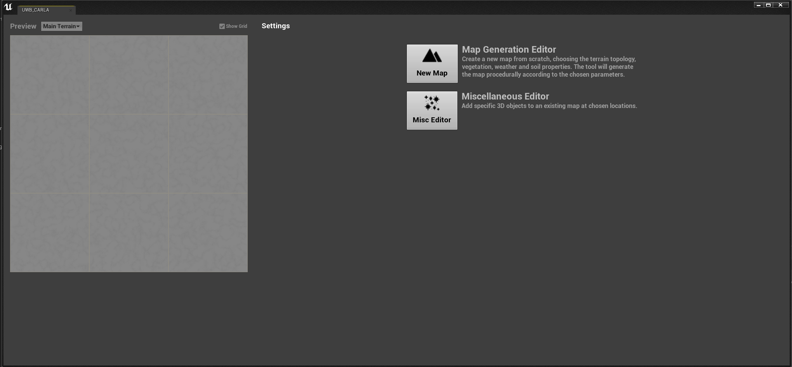
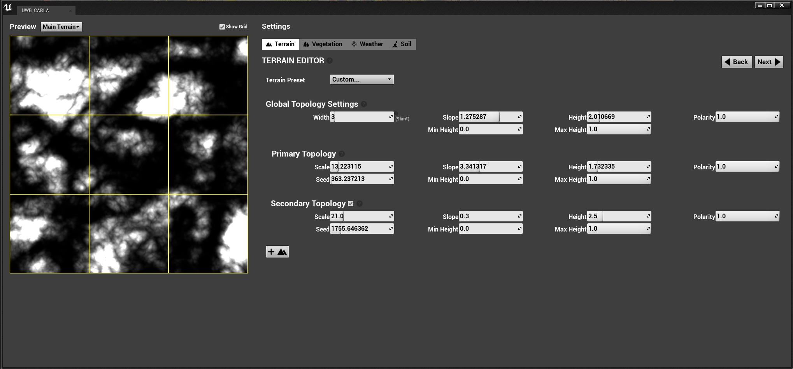
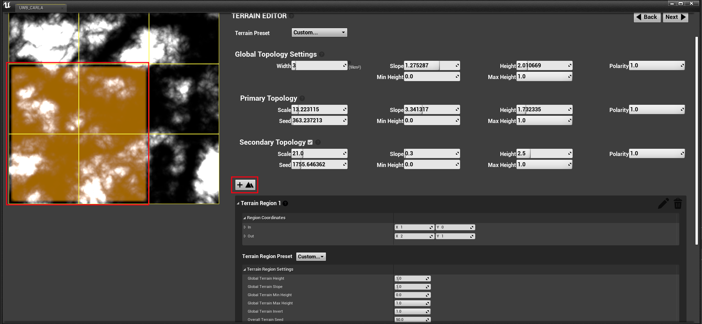
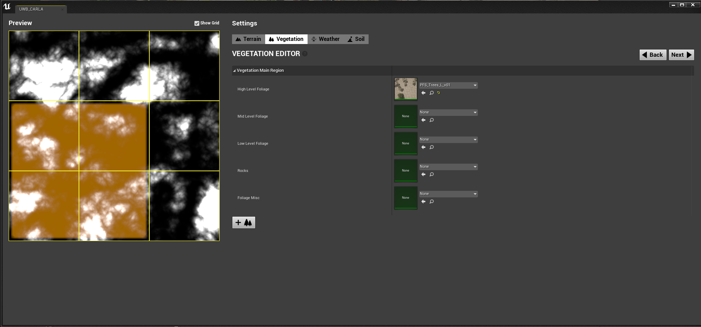
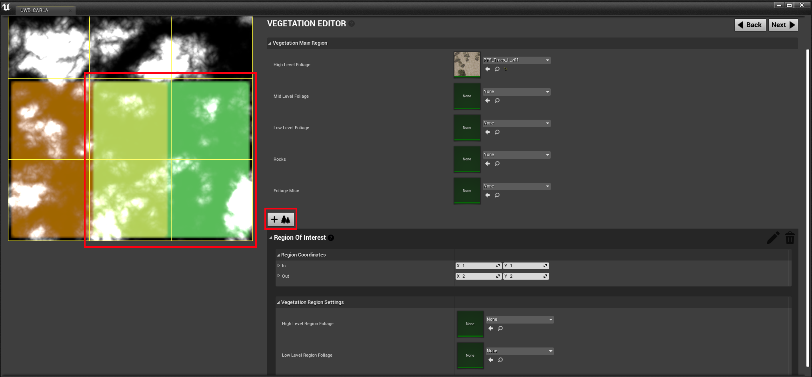
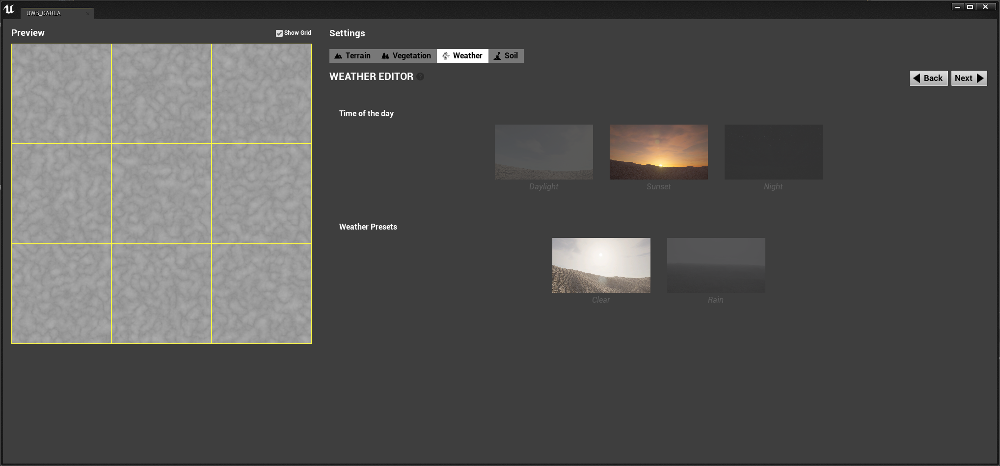
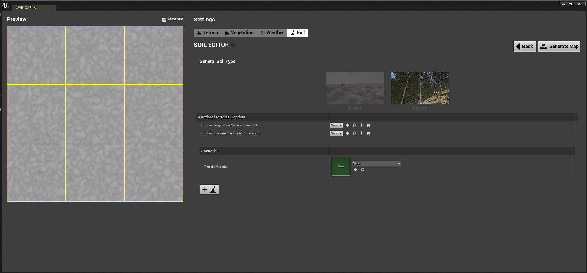
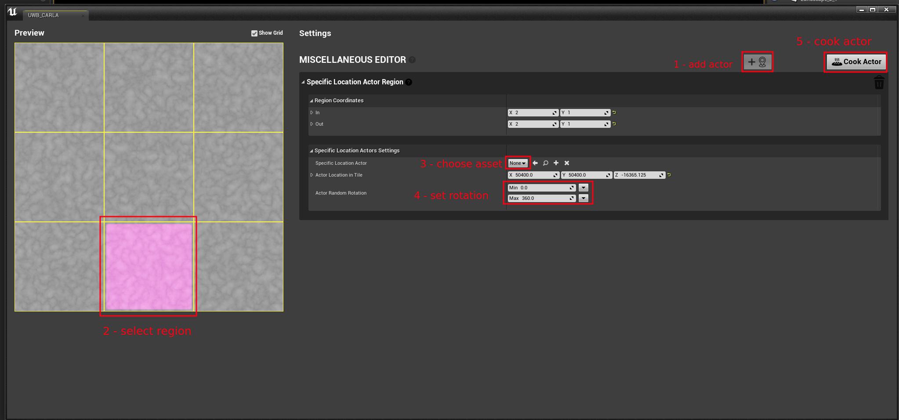
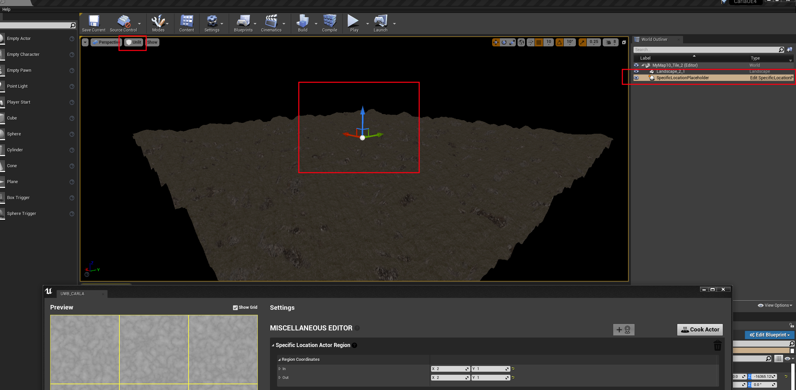

# CARLA Terrain Editor

The CARLA Terrain Editor is a tool for creating random variations of desert and forest landscapes for the purpose of creating training data for off-road or all-terrain vehicles. The tool enables the creation of landscapes with variation in elevation to create hills, dunes and valleys and allows the random distribution of 3D vegetation and rocks on the surface of the map. Terramechanics soil models are provided to simulate the effect of differing soil types on the dynamics of the off road vehicle.

*   [__Terrain Editor__](#terrain-editor)  
	*   [Terrain parameters](#terrain-parameters)  
	*   [Terrain regions](#terrain-regions)  
	*   [Terrain material](#terrain-material)  
*   [__Vegetation Editor__](#vegetation-editor) 
    *   [Vegetation catalogue](#vegetation-catalogue) 
	*   [Vegetation regions](#vegetation-regions) 
*   [__Weather Editor__](#weather-editor) 
*   [__Soil and Terrain Material__](#soil-and-terrain-material)
	*   [Optional terrain blueprints](#optional-terrain-blueprints) 
	*   [Terrain material](#terrain-material)
	*   [Generating the map](#generating-the-map)    
*   [__Miscellaneous Editor__](#miscellaneous-editor) 

---
## Terrain Editor

### Launching the terrain editor

The Terrain Editor works as a tool within the Unreal Editor. To launch the Unreal Editor, follow the instructions to [build CARLA from source](build_carla.md). After building, run `make launch` from the command line inside the CARLA route folder. 

In the Unreal Editor Content Browser, navigate to the `Carla Tools Content > Map Generator folder`. Right click on the UWB_CARLA icon and choose *Run Editor Utility Widget*. This will launch the Terrain Editor. 

In the opening screen, you can choose to create a new map from scratch, or to add chosen 3D assets to an existing map. If you are creating a new map, choose a non-existing directory path and map name in the dialogue. If you want to alter an existing map, choose the [Miscellaneous Editor](#miscellaneous-editor).

### Terrain parameters

The Terrain Editor provides parameters to alter the terrain topology. The tool works by creating a height map from one or two layers of Perlin noise that are multiplied together. 

A preview on the left hand side of the interface visualizes the impact of parameter adjustments on the height map. There are 3 sets of parameters that control the height map. 

* __Global Topology Settings__ - these parameters are applied to the whole map, after the two layers have been multiplied (if two layers are used)

* __Primary / Secondary Topology Settings__ - These parameters operate on each noise layer individually, before multiplication.

The secondary noise layer can be deactivated if only one noise layer is required. 

In the Global Topology Settings, the *__width__* parameter controls the overall size of the map in km. The map is constrained to be square, so the height is equal to the width. 

The parameters adjust the nature of the noise:

* __Scale__ - controls the spatial frequency of the noisy variations, the higher the scale the higher the frequency of variations. Low scale parameters will create valleys and hills, high scale parameters will create dense bumps or dunes. 

* __Seed__ - smoothly modulates the spatial pattern of the noise, changing the position of the peaks and valleys.

* __Height__ - multiplies the height map by a constant factor and raises the height of all areas. Higher parts of the map may get clipped as they move beyond the maximum threshold.

* __Min Height__ - changes the minimum height threshold of the map, clipping anything below the threshold. This can be used to flatten the lowest parts of valleys.

* __Max Height__ - changes the maximum height threshold of the map, clipping anything above the threshold. This can be used to flatten the tops of hills.

* __Polarity__ - changes the vertical polarity of the map. High areas become low and low areas become high. 

### Terrain regions

Map sub-regions can be created with specific terrain parameter settings using the *Add Terrain Region* option. To select a region, press the *Add Terrain Region* option, select the tile in the preview that you wish to be the top left corner of your preferred region, then select the bottom right tile of your preferred region. Regions can be square or rectangular. In the newly created parameter dialogue you can then adjust the parameters specifically for the selected region. To view the map preview for the different regions, you can select the region name from the drop down menu above the preview window. 

To preview the parameter adjustments for terrain regions, use the drop down menu above the preview window. 

## Vegetation Editor

The Vegetation Editor enables the population of the map with vegetation and foliage as well as rocks and organic debris. The vegetation editor has 5 slots for vegetation generator selections. The vegetation generators are referred to as *Procedural foliage spawners* - PFS.

* __High Level Foliage__ - trees and large bushes
* __Mid Level Foliage__ - bushes and shrubs
* __Low Level Foliage__ - small bushes, flowers, shrubs, fungi and grasses
* __Rocks__ - rocks and scree
* __Foliage Misc__ - for an arbitrary foliage selection

Click on the dropdown selector to open the list of vegetation assets, use the filter to narrow down the selection. 

Each vegetation generator comes in __high__, __medium__ and __low__ density variants to control the density of the chosen vegetation. The density is denoted by an __H__, __M__ or __L__ in the name. e.g. __PFS_Bushes_H_v01__, __PFS_Bushes_M_v01__, __PFS_Bushes_L_v01__.

### Vegetation catalogue

The CARLA asset library provides a wide variety of trees, bushes, plants and rocks for the vegetation. Please refer to the [__vegetation catalogue__](tool_vegetation_catalogue.md) to choose vegetation.

### Vegetation regions

Vegetation sub-regions can be created with specific vegetation selections using the *Add Vegetation Region* option. To select a region, press the *Add Vegetation Region* option, then select the tile in the preview that you wish to be the top left corner of your preferred region. Then select the bottom right tile of your preferred region. Regions can be square or rectangular. In the newly created vegetation region dialogue you can make two new vegetation selections for high and low level vegetation. 

## Weather Editor

The default weather for the map is set in the weather page. This will be the weather setting when the map is loaded. The weather settings can be changed at runtime through the PythonAPI.

## Soil and Terrain Material

The soil page provides access to CARLA's Terramechanics soil models. The soil models have been derived from Finite Element Modelling of different soil types that have been used to train a neural network to model the soil-tyre interaction in real time in the simulation. This has the impact of realistically simulating vehicle mechanics when traveling over differing soil types. As with the terrain and vegetation settings, map sub-regions can be selected for specific soil settings in the same way. Choose the soil type in the *General Soil Settings* section.

### Optional Terrain Blueprints

The terrain blueprints are the models that control the vegetation collision behaviour and the soil terramechanics. If you wish to use these models in your simulation you should select the following blueprints using the drop-down menu:

* __Optional Vegetation Manager Blueprint__ - BP_VegetationManager
* __Optional Terramechanics Actor Blueprint__ - BP_TerramechanicsActor

If you do not wish to use vegetation physics or terramechanics, leave these options as *None*.

### Terrain material

The terrain material controls the appearance of the map surface. Choose from the terrain materials available for forest and desert.

### Generating the map

After choosing the soil, blueprint and terrain material settings, you can now generate the map. At this point, ensure to review the settings you have made in the Terrain, Vegetation, Weather and Soil tabs, as generating the map can be time consuming. Once you are satisfied with your settings, press *Generate Map* and the Unreal Editor will start to cook the assets. Map generation normally takes a few minutes for small maps (2-5 km width) and can take up to and over an hour for large maps (>20 km width). 

After this step, the map is ready to use. You may wish to add further details using the miscellaneous editor. 

## Miscellaneous Editor

The Miscellaneous Editor is used to add specific 3D assets to an existing map. Open the Miscellaneous Editor from the tool start screen and in the file path dialogue, choose the path for map that you want to work on. 

Click on the "Add Actor" control, then select the tile where you wish to add 3D assets. The Unreal Editor will load the relevant map tile in the 3D editor. Choose the type of 3D asset you wish to add in the *Specific Location Actor* dropdown menu. You may adjust the random rotation parameters. 

Minimize or move the Terrain Editor interface to reveal the 3D viewport in Unreal Editor. You may need to switch the *View mode* to *Unlit* in the view mode selector in the top left of the 3D viewport to see the map. 

Select the *SpecificLocationPlaceHolder* in the World Outliner on the right hand side of the screen, this will provide a location widget with red, green and blue arrows in the 3D viewport. Navigate in the 3D viewport using the WASD keys and the mouse to move the view. Grab the widget arrows to move the locator to a position of interest. The widget will automatically stick to the surface of the map. Once you have found the desired location, press *Cook actor*. The new 3D asset will appear in the map. You can repeat this process several times to add the same asset, for example, to create a cluster of trees. If you want to add another 3D asset, press the *Add actor* again and repeat the process with a different 3D asset selected.

